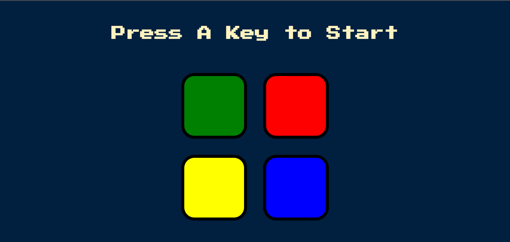

# Simon`s Game

This is webpage game, based off the very popular "Simons Game" Simon`s Game is an electronic game of memory skill. In the game you have four different colors and each color makes a different sound. The user is required to repeat the sequence. If the sequence is done correctly then the series becomes harder and harder, until the user fails or time runs out and the game is over.

## Table of contents

- [Overview](#overview)
  - [The challenge](#the-challenge)
  - [Screenshot](#screenshot)
  - [Links](#links)
- [My process](#my-process)
  - [Built with](#built-with)
  - [What I learned](#what-i-learned)
  - [Continued development](#continued-development)
  - [Useful resources](#useful-resources)
- [Author](#author)
- [Acknowledgments](#acknowledgments)

**Note: Delete this note and update the table of contents based on what sections you keep.**

## Overview

### The challenge

Users should be able to:

- See 4 different color boxes.
- Should be able to clicks each box.
- Should be able to visually see which boxes are lighting up.
- Should be able to click and reproduce the random order generated.

### Screenshot



### Links

- Solution URL: [https://github.com/chopsquad/Simons-Game](https://github.com/chopsquad/Simons-Game)
- Live Site URL: [https://chopsquad.github.io/Simons-Game/](https://chopsquad.github.io/Simons-Game/)

## My process

- [x] Adding javascript and jquery.
- [x] Testing to see if javascript and jquery are working.
- [x] Creating a new pattern of colors a random number.
- [x] Add flash to the selected color.
- [x] Check if any of the buttons are being clicked and trigger a handler function.
- [x] Handler function should create a new variable, to store the id of the button that got clicked.
- [x] At the top create an empty array called `userClickedPattern`.
- [x] Add contents of `userChosenColour` and `userClickedPattern`.
- [x] When a user clicks on a button the corresponding sound should play.
- [x] Create a function called `playSound()` that takes a singe input called name.
- [x] Take the code used to ply sound and move it into `playSound`.
- [x] Refractor the code in `playSound()` so that it will work for both in `nextSequence()` and when the user clicks a button.
- [x] Create a function called `animatePress()` that takes in a single parameter called `currentColor`.
- [x] Add the class `.pressed` to the button that is being clicked.
- [x] Use javascript to removed the pressed button after 100 milliseconds.
- [ ] Detect when the keyboards is pressed and call next `nextSequence()`
- [ ] Keep track of when it is press and only have it run on the first press
- [ ] Create a new variable called level and set it to 0.
- [ ] At the start have the title say "Press A Key to Start"
- [ ] Increase level by one every time `nextSequence` is called.
- [ ] Add contents of `userChosenColour` and `userClickedPattern`
- [ ] Add contents of `userChosenColour` and `userClickedPattern`
- [ ] Add contents of `userChosenColour` and `userClickedPattern`
- [ ] Add contents of `userChosenColour` and `userClickedPattern`
- [ ] Add contents of `userChosenColour` and `userClickedPattern`
- [ ] Add contents of `userChosenColour` and `userClickedPattern`
- [ ] Add contents of `userChosenColour` and `userClickedPattern`
- [ ] Add contents of `userChosenColour` and `userClickedPattern`
- [ ] Add contents of `userChosenColour` and `userClickedPattern`

### Built with

- Semantic HTML5 markup
- CSS custom properties
- Flexbox
- CSS Grid
-
- [Jquery](https://code.jquery.com/) - JS library

**Note: These are just examples. Delete this note and replace the list above with your own choices**

### What I learned

Use this section to recap over some of your major learnings while working through this project. Writing these out and providing code samples of areas you want to highlight is a great way to reinforce your own knowledge.

-Adding jquery to out html file, must be added before the js file

```html
<script src="https://ajax.googleapis.com/ajax/libs/jquery/3.6.0/jquery.min.js"></script>

<script src="script.js"></script>
```

- How to select a specific element using JQuery

```js
$("element"); //selects all of the elements
$("element.class"); //selects only the ones with the specified class
$("element#id"); // only with the specified ID
```

- How to add a flash effect to a selected elements

```js
//this is using JQuery
$("element").fadeOut(100).fadeOut(100).fadeIn(100).fadeOut(100);
//this could later give us problems but for now this was the easiest method
```

-playing an audio element

```js
let audio = new Audio("source of audio");
audio.play();
```

-adding a click event that tracks what button is being pressed and stores it into an array.

```js
//this is using JQuery
$("element").on("click", function () {
  let audio = new Audio("source of audio");
  audio.play();
});
```

- Refactoring play sound for it to be more usable, meaning turning into a function because it is repeating code.

```js
//this is using JQuery
function(name){
  let audio = new Audio(`${name}.mp3`);
  audio.play();
};
```

-Adding a class to element and then removing it after a certain amount of time passed

```js
//this is using JQuery
function name(color) {
  //select the color using jQuery
  $(`div.${color}`).addClass("name of class");
  //setting a time out for a period of time
  setTimeout(function () {
    //select the element again and remove the class use removeClass
    $(`div.${color}`).removeClass("name of class");
  });
```

-Checking the document to see for a key press and running the sequence when key press is found.

```js
//keeping track of the first keyboard press.
let firstPress = 0;
//detecting when the keyboard has been pressed
$(document).on("keydown", function (event) {
  console.log(event);
  //call nextSequence();
  if (firstPress === 0) {
    nextSequence();
    firstPress++;
  }
});
```

-In the above i used the variable and set it to 0 to keep track of the key press. I used a if statement to check if the key press is equal to 0 and if it is run the function and add 1 t0 first press.

If you want more help with writing markdown, we'd recommend checking out [The Markdown Guide](https://www.markdownguide.org/) to learn more.

**Note: Delete this note and the content within this section and replace with your own learnings.**

### Continued development

Use this section to outline areas that you want to continue focusing on in future projects. These could be concepts you're still not completely comfortable with or techniques you found useful that you want to refine and perfect.

**Note: Delete this note and the content within this section and replace with your own plans for continued development.**

### Useful resources

- [Jquery google link](https://developers.google.com/speed/libraries) - This helped me find the latest JQuery hosted library on google. I then used this script in the html file.
- [Adding a flash effect with JQuery](https://stackoverflow.com/questions/275931/how-do-you-make-an-element-flash-in-jquery) - Here i learned a lot about different ways to add a flash effect on the element you have selected.
- [laying Audio](https://stackoverflow.com/questions/9419263/how-to-play-audio) - I learned how to implement audio. Then be able to play it.

**Note: Delete this note and replace the list above with resources that helped you during the challenge. These could come in handy for anyone viewing your solution or for yourself when you look back on this project in the future.**

## Author

- Website - [Add your name here](https://www.your-site.com)
- Frontend Mentor - [@yourusername](https://www.frontendmentor.io/profile/yourusername)
- Twitter - [@yourusername](https://www.twitter.com/yourusername)

**Note: Delete this note and add/remove/edit lines above based on what links you'd like to share.**

## Acknowledgments

This is where you can give a hat tip to anyone who helped you out on this project. Perhaps you worked in a team or got some inspiration from someone else's solution. This is the perfect place to give them some credit.

**Note: Delete this note and edit this section's content as necessary. If you completed this challenge by yourself, feel free to delete this section entirely.**
